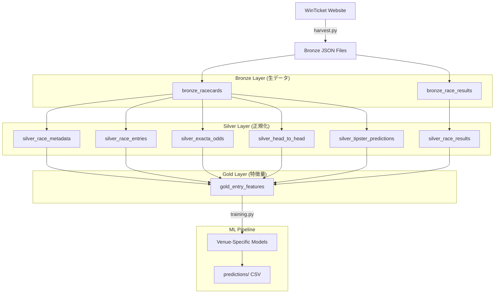
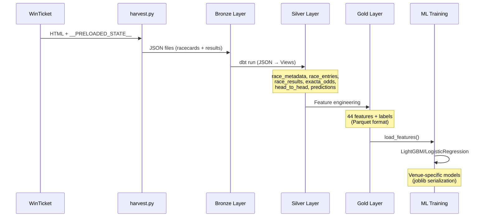

# 競輪予測システム (Keirin Prediction System)

競輪レースの出走表データから機械学習を用いて勝率予測を行うシステムです。WinTicket公式サイトからデータを収集し、DuckDB + dbtによるデータ変換パイプラインを通じて特徴量を生成、scikit-learn/LightGBMによる予測モデルを構築します。

## システム構成

```
keirin-prediction/
├── winticket/              # メインのPythonパッケージ
│   ├── harvest.py          # WinTicketサイトからのデータ収集
│   ├── features.py         # 特徴量定義と抽出ロジック
│   ├── training.py         # モデル学習ユーティリティ
│   ├── models.py           # モデル永続化クラス
│   └── config.py           # ファイルパス設定
├── winticket_dbt/          # dbtによるデータ変換パイプライン
│   ├── models/bronze/      # 生データテーブル定義
│   ├── models/silver/      # 正規化済みテーブル定義
│   └── models/gold/        # 特徴量テーブル定義
├── data/                   # データレイク (Git管理対象外)
│   └── winticket_lake/
│       ├── bronze/         # 生データ（JSON）
│       ├── silver/         # 正規化データ
│       └── gold/           # 特徴量データ（Parquet）
├── models/                 # 学習済みモデル保存先 (Git管理対象外)
├── predictions/            # 予測結果CSV/TXT保存先 (Git管理対象外)
├── archives/               # 過去データアーカイブ (Git管理対象外)
└── docker-compose.yml      # dbt実行環境
```

## 主要機能

### 1. データ収集 (harvest.py)

WinTicketの出走表ページ・結果ページから以下のデータを収集：

- **対象データ**: 競輪レース出走表、レース結果
- **データソース**: `https://www.winticket.jp/keirin/{venue}/{source}/{cup_id}/{index}/{race_number}`
- **収集方式**: HTMLページの`window.__PRELOADED_STATE__`からJSONデータを抽出
- **保存形式**: JSON（メタデータ付き）

```bash
# 使用例
python -m winticket.harvest --cup-id 044420251112 --venue takeo --race-numbers 1 2 3
```

### 2. データ変換パイプライン (dbt)

3層のデータアーキテクチャでデータを段階的に変換：

#### Bronze層（生データ）
- `bronze_racecards`: 出走表JSON生データ
- `bronze_race_results`: 結果JSON生データ

#### Silver層（正規化データ）
- `silver_race_metadata`: レース基本情報
- `silver_race_entries`: 出走者情報
- `silver_race_results`: レース結果
- `silver_head_to_head`: 選手間対戦成績
- `silver_exacta_odds`: 2車単オッズ
- `silver_tipster_predictions`: 予想師予測

#### Gold層（特徴量）
- `gold_entry_features`: 機械学習用統合特徴量テーブル

```bash
# dbt実行
docker-compose run dbt run
```

## データパイプラインフロー

### 概要

本システムは5段階のデータパイプラインで構成されています：

1. **データ収集**: WinTicketサイトからレース情報をJSON形式で取得
2. **Bronze層**: 生JSONデータをDuckDBで読み込み可能な形式に変換
3. **Silver層**: 正規化されたテーブル構造でデータを整理
4. **Gold層**: 機械学習用の統合特徴量テーブルを生成
5. **ML学習**: 会場別特化モデルを学習・永続化

### パイプライン図



### データ変換詳細



### 3. 特徴量エンジニアリング (features.py)

44種類の特徴量を定義・抽出：

#### 選手基本データ
- `number`: 車番
- `bracket_number`: 枠番  
- `age`: 年齢
- `player_class`: 選手クラス（S級・A級等）
- `player_group`: グレード（S1、S2、A1等）

#### レース成績データ
- `racePoint`: レースポイント
- `firstRate`, `secondRate`, `thirdRate`: 1着率、2着率、3着率
- `recent_races`: 最近の出走回数
- `recent_avg_order`: 最近の平均着順
- `recent_win_rate`: 最近の勝率
- `recent_top3_rate`: 最近の3着内率

#### 競技場特化データ
- `venue_races`: 当該競技場での出走回数
- `venue_avg_order`: 競技場平均着順
- `venue_win_rate`: 競技場勝率
- `venue_top3_rate`: 競技場3着内率

#### 展開予想データ
- `exSpurt`: スパート指数
- `exThrust`: 追込み指数
- `exSplit`: 捲り指数
- `exCompete`: 競走力指数
- `exLeftBehind`: 取残し指数

#### ライン分析
- `lineFirstPct`: 先行ライン率
- `lineSinglePct`: 単騎ライン率

#### オッズ・人気データ
- `min/max/avg_exacta_odds_first`: 2車単オッズ統計
- `spread_exacta_odds_first`: オッズ分散
- `min/avg_exacta_popularity_first`: 人気統計

#### 対戦成績
- `field_head_to_head_wins/losses/races`: 同レース内選手との対戦成績

#### レース条件
- `entries_number`: 出走者数
- `distance_m`: 距離（メートル）
- `pick_rank`: 予想師ランキング

### 4. モデル学習 (training.py)

#### サポートモデル
- **Logistic Regression**: `sklearn.linear_model.LogisticRegression`
- **LightGBM**: `lightgbm.LGBMClassifier`

#### 予測ターゲット
- **win**: 1着予測（二値分類）
- **top3**: 3着内予測（二値分類）

#### 会場特化学習
各競技場に特化したモデルを個別に学習・保存：

```python
from winticket.training import VenueModelTrainer

trainer = VenueModelTrainer(
    venue_slug="takeo",
    tipster_id="some_tipster",
    model_type="lightgbm",  # or "logistic"
    target="win"  # or "top3"
)

stats = trainer.train()
print(f"学習完了: {stats.rows}行, 正例{stats.positives}, 負例{stats.negatives}")
```

#### 「Heat」モデルについて

本プロジェクトでは、通常のレース予測モデルに加え、特定のレース条件（例：G3予選、F1予選など）に特化した「Heat」モデルを構築・利用します。これにより、特定の条件下での予測精度向上を目指します。

-   **設定ファイル**: `heat_configs/` ディレクトリに、各Heatモデル用の特徴量やパラメータ設定がJSON形式で保存されています。
-   **学習スクリプト**: `scripts/train_odawara_heat.py` のように、特定の会場のHeatレースに特化した学習スクリプトが用意されています。
-   **ユーティリティ**: `scripts/heat_utils.py` には、Heatモデルの学習や評価に共通して使われる関数が含まれています。

##### 直近開催アップデート例（小松島 Day3 1R / 2025-11-14）
1. **最新データ取得**
   ```bash
   source .venv/bin/activate
   python -m winticket.harvest --cup-id 2025111273 --venue komatsushima --index 3 --race-numbers 1 --sources racecard raceresult
   ```
2. **Gold特徴量の再生成**
   ```bash
   python scripts/build_features.py --venue komatsushima --cup-ids 2025111273 --output data/winticket_lake/gold/features/komatsushima_2025111273.parquet
   ```
3. **LightGBM再学習**（最新のDay1〜Day3結果553行を使用）
   ```bash
   python - <<'PY'
   from winticket.training import VenueModelTrainer

   for target in ("win", "top3"):
       trainer = VenueModelTrainer(
           venue_slug="komatsushima",
           tipster_id="dsc-00",
           model_type="lightgbm",
           target=target,
       )
       stats = trainer.train()
       print(target, stats)
   PY
   ```
   - Win: 553行（陽性80/陰性473）
   - Top3: 553行（陽性242/陰性311）
4. **再推論（Top3例）**
   ```bash
   python - <<'PY'
   import pandas as pd, joblib
   from winticket.features import FEATURE_COLUMNS

   df = pd.read_parquet('data/winticket_lake/gold/features/komatsushima_2025111273.parquet')
   target = df[(df['race_number']==1) & (df['day_index']==3) & (~df['is_absent'].fillna(False)) & (df['tipster_id']=='dsc-00')]
   bundle = joblib.load('models/winticket/komatsushima_top3_lightgbm.joblib')
   probs = bundle['estimator'].predict_proba(target[bundle['feature_names']].fillna(0.0))[:,1]
   target.assign(top3_prob=probs).sort_values('top3_prob', ascending=False).to_csv('komatsushima_day3_r1_top3_predictions.csv', index=False)
   ```
   サマリ：#7 下沖功児 86.1%、#4 泉谷元樹 56.5%、#5 南部亮太 32.7%、#1 藤野貴章 23.8% …という序列で複勝・ワイドの意思決定に利用できます。

##### CLIでの予測・ヒット率表示
`scripts/predict_race.py` を使うと、Win/Top3 両方の確率と最新の的中率をワンコマンドで取得できます。

```bash
source .venv/bin/activate
python scripts/predict_race.py \
  --venue komatsushima \
  --features data/winticket_lake/gold/features/komatsushima_2025111273.parquet \
  --schedule-date 20251114 \
  --day-index 3 \
  --race-number 1
```

出力例：

```
Race #1 predictions (tipster dsc-00):
 number player_name  win_prob  top3_prob  pick_rank ...
      7        下沖功児  0.015166   0.861425        1.0 ...
...
Current hit rates — win: 100.0%, top3 coverage: 91.5%
```

- **win_prob** と **top3_prob** を同時表示（デフォルト）
- **Current hit rates** は同一特徴量ファイル全体での実測的中率（勝者ヒット率／上位3人カバー率）
- `--model-type logistic` や `--tipster-id other_tipster` などの切替にも対応

### 5. モデル管理 (models.py)

`VenueModelStore`クラスでモデルの永続化を管理：

```python
from winticket.models import VenueModelStore

store = VenueModelStore()

# モデル保存
store.save("takeo", target="win", model_type="lightgbm", bundle=model_data)

# モデル読込
bundle = store.load("takeo", target="win", model_type="lightgbm")
```

## 技術仕様

### 依存関係
```
duckdb==1.1.3          # インメモリ分析DB
pandas==2.2.3          # データ分析
scikit-learn==1.5.2    # 機械学習
lightgbm==4.5.0        # 勾配ブースティング
requests==2.32.3       # HTTP通信
joblib==1.4.2          # モデル永続化
pyarrow==17.0.0        # Parquetファイル操作
```

### データベース
- **DuckDB**: 軽量OLAP データベース
- **ストレージ**: Parquet形式での列指向ストレージ
- **クエリエンジン**: dbt経由でのSQL変換

### 実行環境
- **Python**: 3.8以上
- **Docker**: dbt実行環境
- **メモリ**: 4GB推奨（DuckDBメモリ制限）

## セットアップ手順

1. **依存関係インストール**
```bash
pip install -r requirements.txt
```

2. **データ収集**
```bash
python -m winticket.harvest --cup-id CUP_ID --venue VENUE_SLUG --race-numbers 1 2 3
```

3. **データ変換**
```bash
docker-compose run dbt run
```

4. **モデル学習**
```python
from winticket.training import VenueModelTrainer
trainer = VenueModelTrainer("takeo", tipster_id="tipster", model_type="lightgbm")
trainer.train()
```

## ファイル出力例

予測結果CSVやサマリーCSVは `predictions/` ディレクトリに出力されます。

### 予測結果CSV
```csv
race_number,number,player_name,win_prob,finish_order
1,1,天野純平,0.485445380011595,1
1,2,山田隼司,0.38293413906067125,4
```

### サマリーCSV  
```csv
race_number,total_entries,predicted_winner,actual_winner,prediction_correct
1,7,5,1,False
2,7,4,1,False
```

## 運用上の注意事項

### データ収集
- WinTicketサイトの利用規約を遵守してください
- 過度なリクエストによるサーバー負荷を避けてください
- `requests.get(timeout=30)`で適切なタイムアウトを設定済み

### モデル精度
- 競馬・競輪は確率的要素が大きく、予測精度には限界があります
- 実際の投票判断には十分な検討とリスク管理が必要です
- バックテストと実運用での精度差にご注意ください

### データ管理
- `data/`, `models/`, `predictions/`, `archives/` ディレクトリ内のファイルはGit管理対象外です。
- 大量のJSONファイルやモデルファイルが蓄積されるため、適切なディスク容量を確保してください  
- 個人情報を含む可能性があるため、データの取扱いに注意してください

## ライセンス

このソフトウェアは教育・研究目的での利用を想定しています。
商用利用や投票助言業務での利用は各自の責任で法的確認を行ってください。
